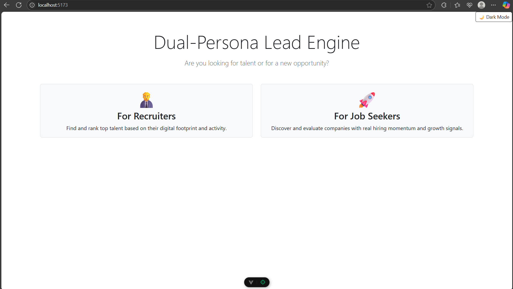

#  Intelligent Business Leads Engine

> **This is a dual-persona web app that helps recruiters discover high-quality tech talent and job seekers identify companies with real hiring momentum — This was built for CapraeCapital AI readiness challenge**

---

## [Click here to watch a Video demonstration of the Application ](https://youtu.be/UTxtP0uQNec)

## Purpose & Value Proposition

This project was created as part of a time-boxed challenge to demonstrate business acumen, technical skill, and UI/UX thinking in under 5 hours of development.

It is a reverse-engineered, redesigned, and AI-enhanced lead generation tool that simulates the core functionality of advanced scraping-based platforms used in talent acquisition and job hunting.

By combining **real-time web scraping, AI-powered scoring, and modern frontend design**, this tool provides **actionable insights** to both:

- **Recruiters** looking for top open-source developers with strong GitHub presence
- **Job Seekers** looking for high-growth companies actively hiring

---

## 🔍 Features

### Dual Persona UX
- 🚀 **For Job Seekers:** Get ranked lists of companies showing strong hiring signals, growth, and relevance to your interests.
- 👨‍💼 **For Recruiters:** Discover and rank tech candidates by GitHub activity, skills, and social proof (followers/repos).

### AI-Enhanced Ranking
- Candidate and company scores are computed using pre-trained models that analyze textual bios, job posts, and metadata.
- Natural Language Processing (NLP) models extract context from descriptions and score based on relevance and momentum.

### Real-Time Web Scraping
- Utilizes BeautifulSoup & `requests` for scraping GitHub user profiles and job listing websites.
- Cleans, parses, and extracts key data points (bios, followers, repositories, jobs, company info, etc.)

### Responsive Frontend
- Built using **Vue 3 + Bootstrap 5** with dark/light mode toggle.
- Smooth transitions and minimal input ensure great UX even for non-technical users.

---

## 🧠 Tech Stack

| Area              | Tech/Tool Used             |
|-------------------|----------------------------|
| Frontend          | Vue 3 + Bootstrap 5        |
| Backend           | Flask + Flask-RESTful      |
| Web Scraping      | BeautifulSoup4, requests   |
| ML/NLP Models     | Scikit-learn, sentence-transformers |
| Deployment        | Render.com (full stack)    |

---

## ⚙️ Installation & Setup

### 1. Clone the Repository

```bash
git clone https://github.com/Sesha-krish/Intelligent-Business-Leads-Engine.git
cd Intelligent-Business-Leads-Engine
```
### 2. Backend Setup(Flask API)
```bash
cd backend
python -m venv envv
envv\Scripts\activate  # For Windows
pip install -r requirements.txt
python app.py

```

### 3. Frontend Setup(Vue CLI) 
```bash
cd frontend
npm install
npm run dev
```
Now open http://localhost:5173 in your browser.

